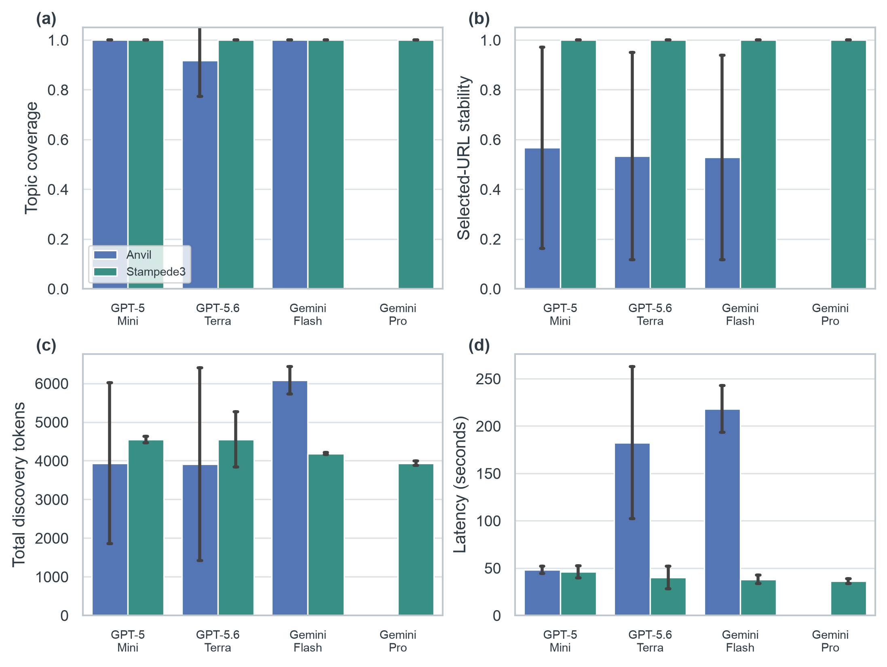

# Document discovery quality and cost

This report summarizes **21 completed discovery runs** over Anvil and
Stampede3. Each available model-site pair has three repetitions. Gemini Pro
currently has Stampede3 results only, so its aggregate is not a cross-site
comparison.

## Table 2: Document discovery breadth and compliance

| Site | Full topic coverage | Official in-scope pages | Scope violations | Fetch yield | URL stability | Tokens/run | Latency/run (s) |
|---|---|---|---|---|---|---|---|
| Anvil | 8/9 (88.9%) | 24/24 (100.0%) | 0 | 63/105 (60.0%) | 0.543 | 4643 ± 1956 | 149.6 ± 88.2 |
| Stampede3 | 12/12 (100.0%) | 12/12 (100.0%) | 0 | 122/123 (99.2%) | 1.000 | 4303 ± 411 | 40.0 ± 7.3 |

Full topic coverage means the selected corpus covers submission, resources,
storage, and networking. Official in-scope pages are selected pages whose host
matches the site's allowlisted documentation domain and whose deterministic
scope classifier labels them `target_site`. URL stability is mean selected-URL
Jaccard similarity to repetition one within each model-site group. Costs are
reported as mean ± one standard deviation per discovery run.

## Per-model summary

| Model | Runs | Sites | Mean coverage | Minimum coverage | URL stability | Selected pages | Mean tokens | Mean latency (s) |
|---|---|---|---|---|---|---|---|---|
| gpt-5-mini | 6 | 2 | 1.000 | 1.000 | 0.783 | 1.8 | 4239.2 | 47.1 |
| gpt-5.6-terra | 6 | 2 | 0.958 | 0.750 | 0.767 | 2.0 | 4231.7 | 111.2 |
| gemini-3.6-flash | 6 | 2 | 1.000 | 1.000 | 0.764 | 1.7 | 5132.5 | 128.0 |
| gemini-3.1-pro-preview | 3 | 1 | 1.000 | 1.000 | 1.000 | 1.0 | 3933.7 | 36.2 |

## Quality and cost

[Vector PDF figure](discovery-model-comparison.pdf)

Panel (a) reports coverage of the four tracked discovery topics: submission,
resources, storage, and networking. Panel (b) reports selected-page stability
as URL Jaccard similarity to repetition one. Panels (c) and (d) report total
discovery tokens and wall-clock latency. Error bars show one standard
deviation over the available repetitions.

## Site-level values

| Site | Model | Runs | Coverage | URL stability | Tokens | Latency (s) |
|---|---|---|---|---|---|---|
| Anvil | gpt-5-mini | 3 | 1.000 | 0.567 | 3935.3 | 48.2 |
| Anvil | gpt-5.6-terra | 3 | 0.917 | 0.533 | 3912.3 | 182.5 |
| Anvil | gemini-3.6-flash | 3 | 1.000 | 0.528 | 6081.0 | 218.0 |
| Stampede3 | gpt-5-mini | 3 | 1.000 | 1.000 | 4543.0 | 46.0 |
| Stampede3 | gpt-5.6-terra | 3 | 1.000 | 1.000 | 4551.0 | 40.0 |
| Stampede3 | gemini-3.6-flash | 3 | 1.000 | 1.000 | 4184.0 | 38.0 |
| Stampede3 | gemini-3.1-pro-preview | 3 | 1.000 | 1.000 | 3933.7 | 36.2 |

## Interpretation boundary

Topic coverage and URL stability are useful automated proxies, but they do not
establish that a selected page is authoritative or that it contains every
needed policy field. Those claims require a manual page-relevance audit or
downstream field extraction accuracy. Latency also includes web search and
fetch time, so it is not purely model inference time.
