# RQ1: Profile accuracy and abstention

## Research question

**RQ1. Can the pipeline construct accurate site profiles, and does it abstain
where a site is silent rather than guessing?**

The analysis compares the final evidence-backed profiles against hand-built
ground truth at three sites. It evaluates populated values, correct and false
abstentions, unsupported values, evidence conflicts, and citation integrity.

## Run configuration

- **60 completed profile builds:** 20 each for Anvil, Stampede3, and ND CRC.
- **Models:** GPT-5 Mini, GPT-5.6 Terra, Gemini Flash, and Gemini Pro.
- **Retrieval:** one BM25 run, three LLM-expanded BM25 runs, and one
  full-corpus run per site-model pair.
- **Frozen inputs:** every run for a site uses the same login measurement,
  pilot result, and documentation corpus. No evaluation run performs new
  discovery, measurement, or pilot submission.
- **Ground truth:** 147 fields for Anvil, 159 for Stampede3, and 68 for ND CRC,
  producing 7,480 run-field observations.
- **Balancing:** BM25 and full corpus have weight one; each expanded repetition
  has weight one third. Every model-retrieval configuration therefore has
  equal aggregate weight.
- **Matching:** populated values use field-specific numeric, set, pattern, or
  normalized-text rules. Site silence and not-applicable states are both
  evaluated as expected absence in this preliminary analysis.

The analysis is reproducible with:

```bash
python evaluation/rq1/run_rq1_analysis.py
```

## Field outcomes

| Site | Precision | Recall | Abstention accuracy | Field accuracy |
|---|---:|---:|---:|---:|
| Anvil | 0.977 | 0.867 | 0.969 | 0.889 |
| Stampede3 | 0.957 | 0.906 | 0.935 | 0.912 |
| ND CRC | 0.990 | 0.764 | 0.972 | 0.777 |
| Macro mean | 0.975 | 0.846 | 0.959 | 0.859 |

Precision exceeds recall in the macro result and at all three sites. The
predicted abstention rate is highest at Anvil (0.306), followed by ND CRC
(0.274) and Stampede3 (0.238).

Configuration fields are consistently strongest. Policy accuracy is lower:
0.821 at Anvil, 0.876 at Stampede3, and 0.809 at ND CRC. This is the portion of
the profile most dependent on documentation extraction.

## Evidence behavior

The profiles expose configuration-versus-policy disagreement. Stampede3
produces six walltime conflicts per balanced configuration. Anvil produces 7.33
of its eight expected walltime conflicts on average; one configuration failed
to recover the documented limits. Anvil also contains 0.28 other conflicts per
configuration, primarily an erroneous GPU-count disagreement in a few runs.

GPU facts demonstrate both recovery and difficulty. Stampede3 recovers the H100
and PVC counts and models in every configuration. Anvil recovers the A100 model
for the `ai` and `gpu` partitions in 0.222 of configurations and for
`gpu-debug` in 0.028.

## Citations

All 3,052 accepted citations are mechanically valid: the cited chunk exists,
belongs to the target site, uses the frozen source URL, and contains the quoted
text. The 2,257 accepted findings all contain at least one citation. This does
not establish semantic entailment; that requires a separate manual audit.

## Answer to RQ1

The pipeline constructs mostly accurate and conservative profiles for the three
evaluated sites. Macro precision is 0.975, recall is 0.846, abstention accuracy
is 0.959, and field accuracy is 0.859. Precision exceeds recall at every site,
so the dominant failure is leaving a known value unresolved rather than
populating an unsupported value.

The evidence paths are complementary. Login measurement directly establishes
30--38% of evaluated fields per site, documentation recovers another
22--39%, and pilot evidence contributes 4--10%. Correct abstention accounts for
6--21%, leaving 9% unresolved or wrong at Stampede3, 11% at Anvil, and 22% at
ND CRC.

The result is site-dependent. Stampede3 reaches 0.912 field accuracy, Anvil
0.889, and ND CRC 0.777. ND CRC's lower recall shows that abstention is not
always correct: some documented values remain unresolved. At the same time,
the pipeline identifies measurement-documentation disagreements, including
the Slurm walltime conflicts, and recovers GPU facts that login-node
measurement misses. RQ1 is therefore answered positively for accuracy and
conservative behavior, but not as complete coverage: profiles remain partial
where discovery, extraction, or evidence is insufficient.

## Figures

All figures use balanced configuration weights: BM25 and full corpus have
weight one, while each of the three expanded-retrieval repetitions has weight
one third.

The palette uses medium-saturation blue and teal for correct outcomes, red and
amber for errors, and a colorblind-distinguishable blue, teal, and coral site
encoding. It is designed for clear reproduction in an academic paper.

### Compact RQ1 summary

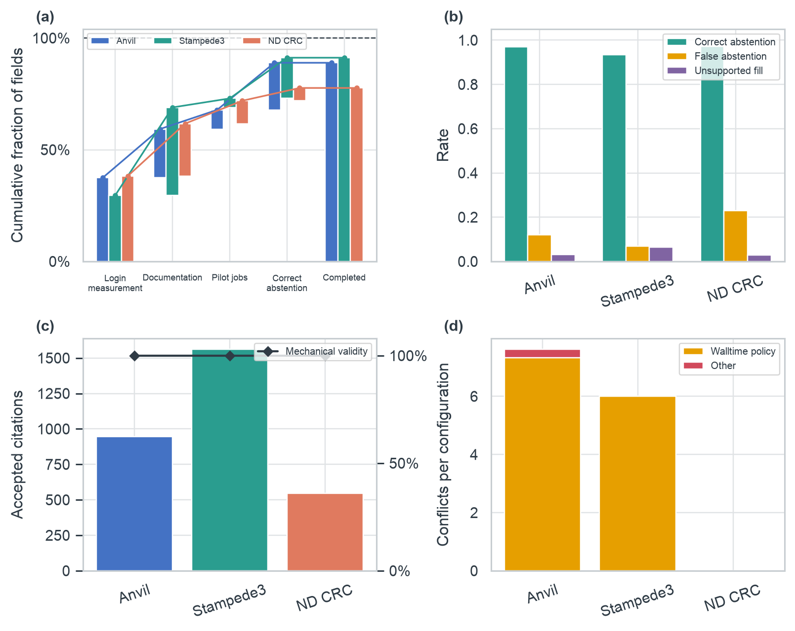

[PDF](figures/rq1-compact-summary.pdf)

Panel (a) cumulatively shows how login measurement, documentation, pilot
evidence, and correct abstention contribute to each completed profile; the gap
to 100% is wrong or unresolved. Panel (b) separates correct abstention, false
abstention, and unsupported fills. Panel (c) shows accepted citation volume and
mechanical validity. Panel (d) shows explicit evidence conflicts, separating
walltime-policy disagreements from other conflicts. Precision, recall, and
field accuracy are omitted because they are reported in the table above.

### Site metrics

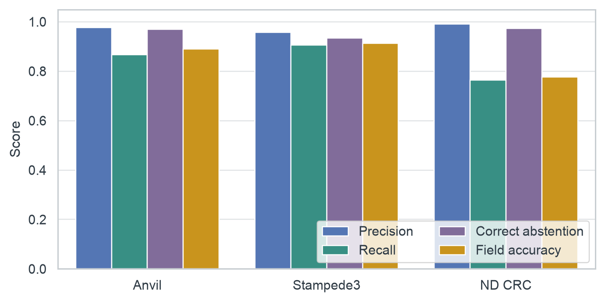

[PDF](figures/site-metrics.pdf)

This grouped comparison separates precision, recall, abstention accuracy, and
overall field accuracy by site. ND CRC has the highest precision but the lowest
recall because it leaves more ground-truth values unresolved.

### Profile completion waterfall

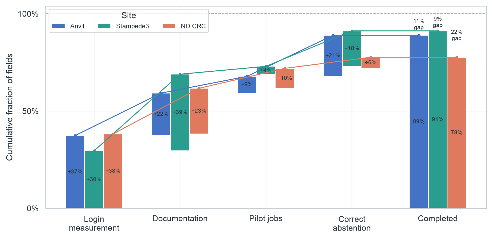

[PDF](figures/profile-completion-waterfall.pdf)

Each floating bar adds the fraction of fields established by login
measurement, documentation, pilot evidence, or correct abstention. The final
bar reports their cumulative completion, while the labeled gap to 100%
combines wrong values with unresolved known values.

### Combined outcome counts

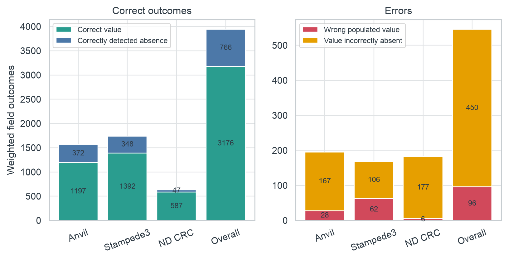

[PDF](figures/combined-outcome-counts.pdf)

The left panel gives weighted counts of correct values and correctly detected
absences. The right panel gives wrong populated values and values that should
have been populated but were absent.

### Accuracy by evidence class

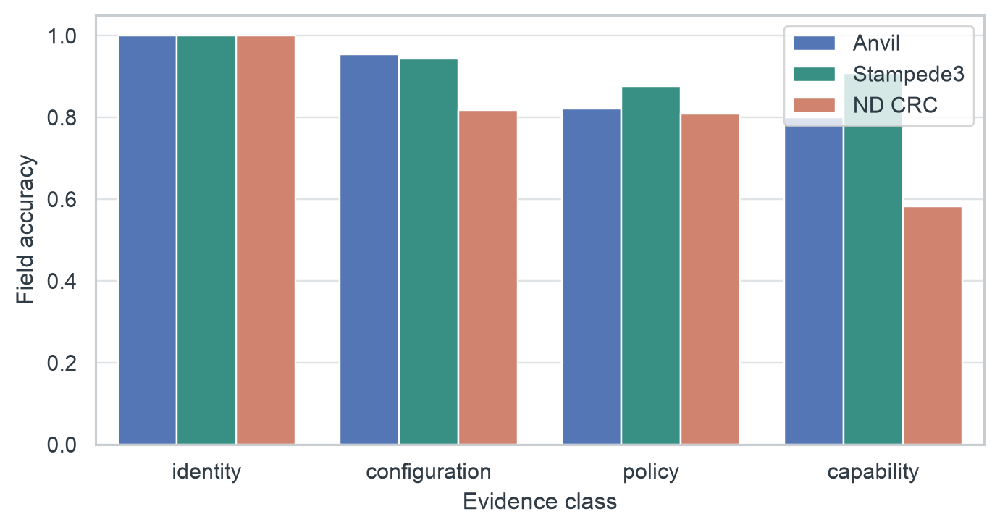

[PDF](figures/accuracy-by-evidence-class.pdf)

This figure separates identity, configuration, policy, and capability fields.
It shows where the full pipeline is strongest and where documentation
extraction or pilot coverage still limits accuracy.

### Accuracy by profile section

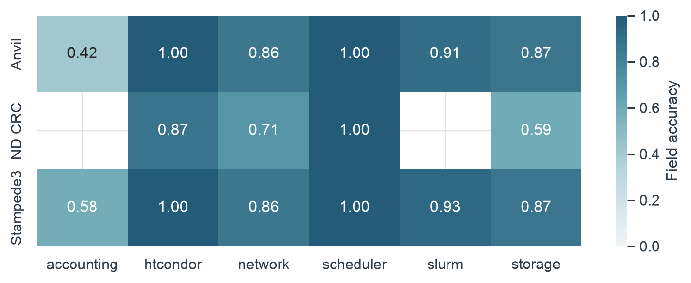

[PDF](figures/accuracy-by-section.pdf)

The heatmap localizes accuracy by site and profile section, making weaknesses
in scheduler, storage, networking, or accounting fields visible without
averaging them into one site-level score.

### Run accuracy distribution

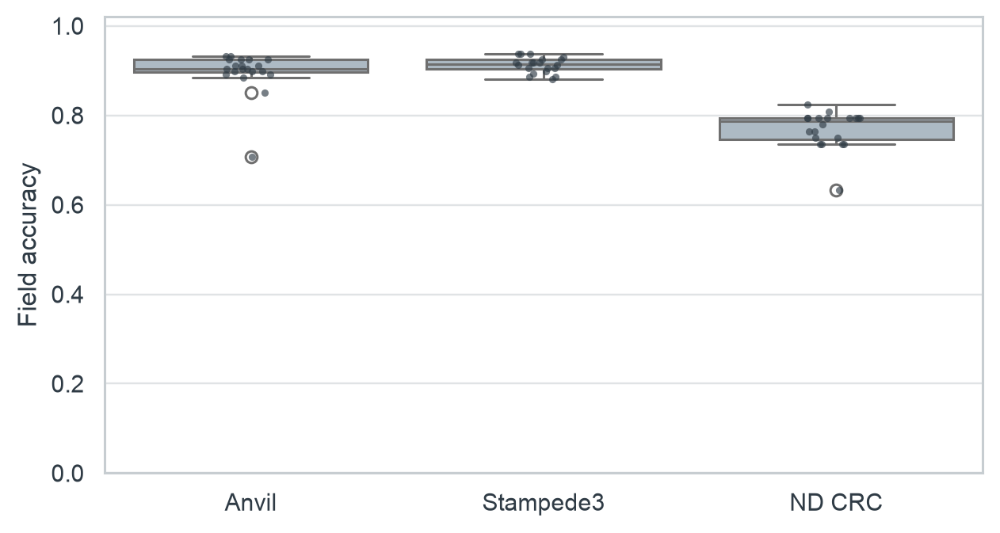

[PDF](figures/run-accuracy-distribution.pdf)

Each point is one model-and-retrieval run; the box summarizes the distribution
for a site. The spread measures output variance that is hidden by aggregate
precision and recall.

### Most frequent field errors

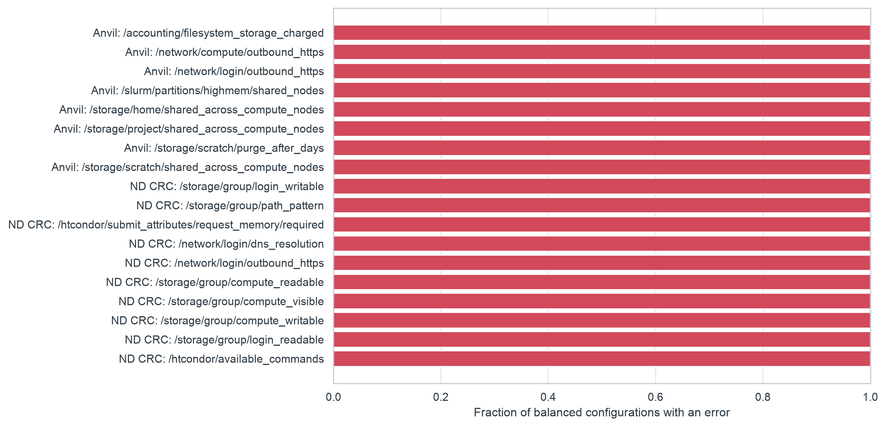

[PDF](figures/most-frequent-field-errors.pdf)

These are the 18 fields with the highest balanced error rate. An error includes
a wrong value, a false abstention, or a value populated where ground truth says
the field is absent.

### Abstention behavior

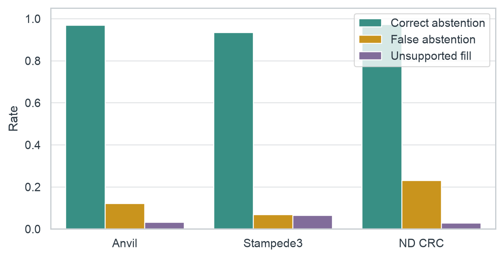

[PDF](figures/abstention-behavior.pdf)

Correct abstention measures silence on truly absent fields. False abstention
measures missed known values, while unsupported fill measures values proposed
for absent fields. These rates use different denominators and should not be
read as parts of one stacked total.

### Citation integrity

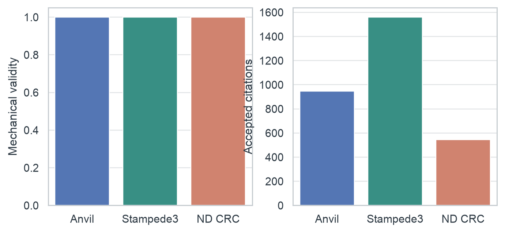

[PDF](figures/citation-integrity.pdf)

The left panel checks that citations point to stored target-site chunks and
contain the recorded quote. The right panel shows citation volume. Mechanical
validity does not by itself prove that the quote semantically entails the
field.

### Source conflicts

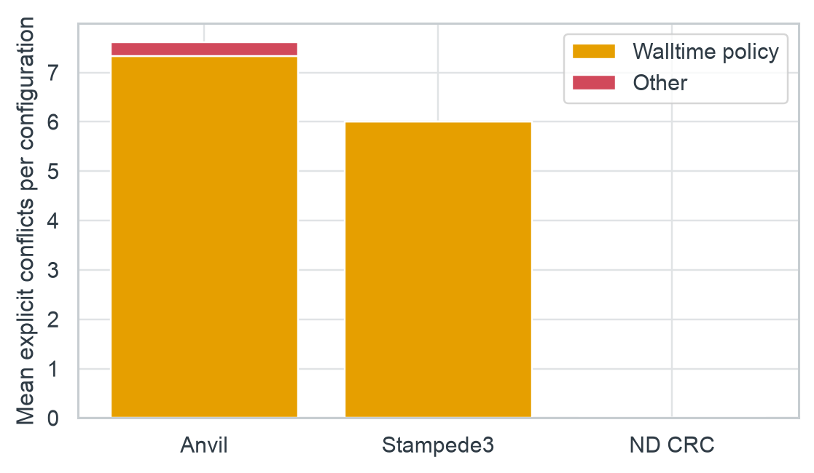

[PDF](figures/source-conflicts.pdf)

This figure counts explicit evidence disagreements per balanced configuration.
Walltime conflicts are separated because they capture the central case where
visible scheduler configuration reports unlimited time but documentation
states an enforced policy limit.

### Measurement-gap recovery

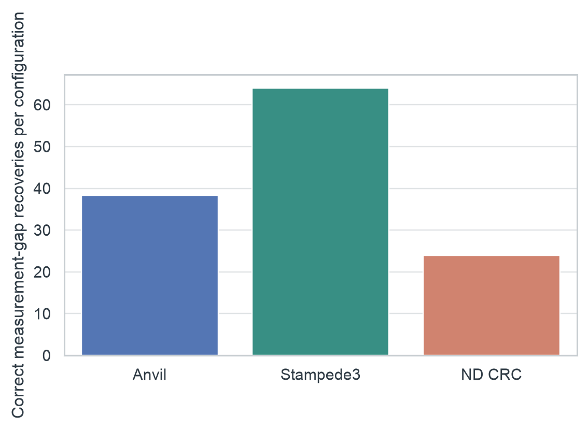

[PDF](figures/measurement-gap-recovery.pdf)

The bars count correct values recovered per configuration when login
measurement supplied no value. They quantify what documentation extraction and
pilot evidence add beyond measurement alone.

### GPU measurement-gap recovery

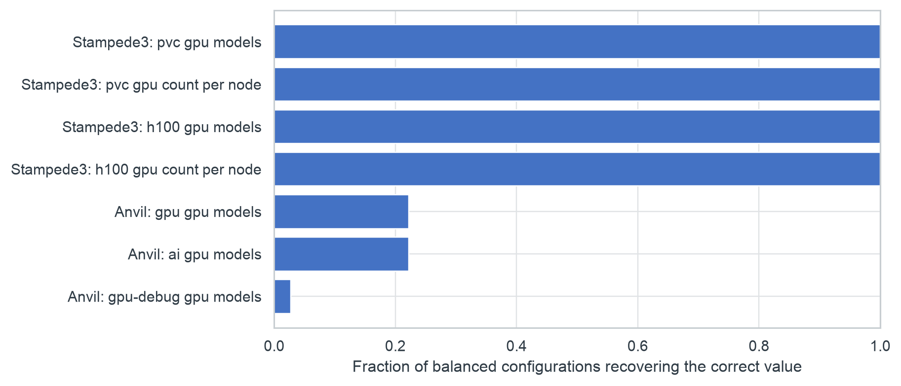

[PDF](figures/gpu-measurement-gap-recovery.pdf)

This field-level view reports how often the pipeline recovers the correct GPU
count or model when login-node measurement cannot see it. Stampede3 is
consistently recovered, while the Anvil GPU-model fields remain difficult.

## Interpretation boundary

These numbers establish what the current evaluator measures. Claims about
semantic citation validity and why a model made an error require manual review.
Model and retrieval comparisons belong to RQ2 and are not inferred from the
site-level RQ1 aggregates.
