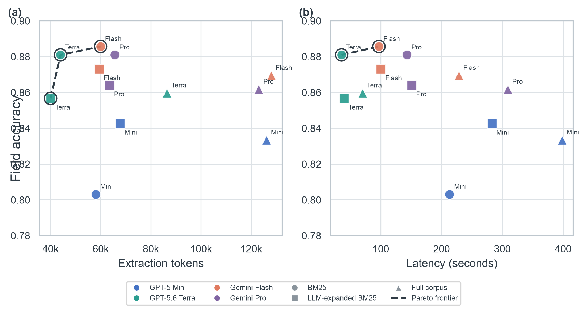
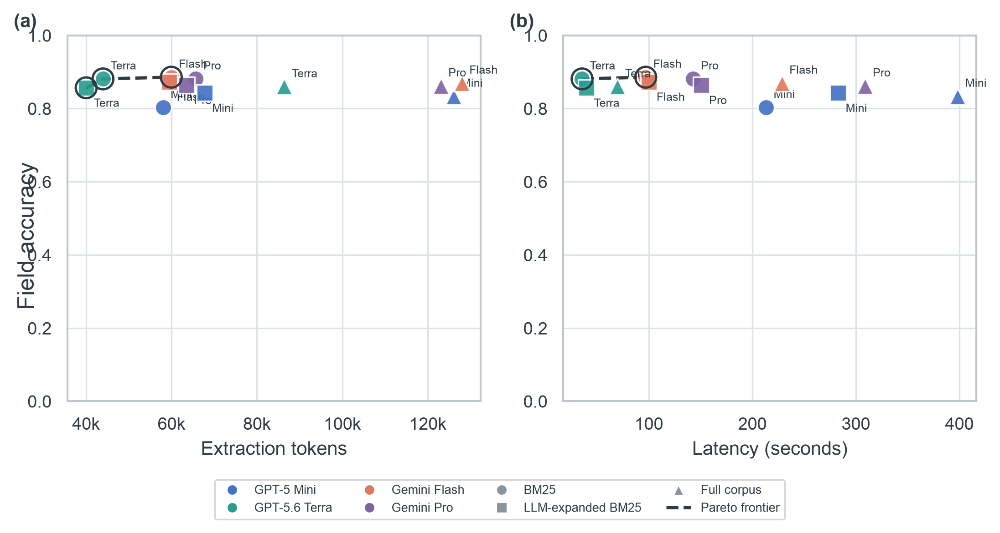

# RQ2: Model and retrieval effects

## Research question

**RQ2. Does the choice of model or retrieval strategy affect what ends up in
the profile?**

The analysis compares final profile quality after deterministic validation,
alongside extraction-token cost, latency, rejected findings, unresolved fields,
and run-to-run variance.

## Run configuration

- **60 completed profile builds:** 3 sites × 4 models × 3 retrieval modes,
  with additional repetitions for the stochastic expanded mode.
- **Sites:** Purdue Anvil, TACC Stampede3, and Notre Dame CRC.
- **Models:** GPT-5 Mini, GPT-5.6 Terra, Gemini Flash, and Gemini Pro.
- **Retrieval:** BM25, LLM-expanded BM25, and full corpus.
- **Repetitions:** one BM25 and one full-corpus run per site-model pair; three
  LLM-expanded BM25 runs per site-model pair.
- **Frozen inputs:** every run for a site uses the same login measurement,
  pilot result, and documentation corpus. No run performs new discovery,
  measurement, or pilot submission.
- **Balancing:** BM25 and full corpus have weight one; each expanded repetition
  has weight one third. Thus every site-model-retrieval configuration has equal
  aggregate weight.
- **Cost boundary:** extraction tokens and profile-build latency are compared
  here. One-time corpus-discovery tokens are excluded because the corpus is
  frozen and shared by every run at a site.

## Results by model

| Model | Field accuracy | Precision | Recall | Tokens | Latency (s) | Rejected | Unresolved |
|---|---|---|---|---|---|---|---|
| GPT-5 Mini | 0.826 | 0.953 | 0.810 | 83,951 | 298.1 | 19.4 | 44.3 |
| GPT-5.6 Terra | 0.866 | 0.982 | 0.851 | 56,793 | 48.2 | 8.2 | 42.9 |
| Gemini Flash | 0.876 | 0.982 | 0.865 | 82,454 | 141.8 | 6.2 | 41.6 |
| Gemini Pro | 0.869 | 0.981 | 0.857 | 84,059 | 200.9 | 13.0 | 41.7 |

The model-level field-accuracy spread is 0.050
(5.0%). Gemini Flash has the highest balanced field
accuracy. GPT-5.6 Terra is within 0.010
(1.0%) of that result while using
31.1% fewer extraction tokens and
66.0% less time than Gemini Flash.

## Results by retrieval strategy

| Retrieval | Field accuracy | Precision | Recall | Tokens | Latency (s) | Model calls | Rejected | Unresolved |
|---|---|---|---|---|---|---|---|---|
| BM25 | 0.863 | 0.972 | 0.849 | 56,900 | 122.1 | 4.7 | 5.0 | 42.1 |
| LLM-expanded BM25 | 0.859 | 0.975 | 0.847 | 57,678 | 143.3 | 5.9 | 13.8 | 42.1 |
| Full corpus | 0.856 | 0.976 | 0.842 | 115,864 | 251.4 | 13.8 | 16.3 | 43.7 |

The retrieval-level field-accuracy spread is only
0.007 (0.7%). Relative to
BM25, full corpus uses 2.04× as many extraction tokens and
takes 2.06× as long without improving aggregate field
accuracy. LLM-expanded BM25 uses 1.01× the tokens and
1.17× the time of BM25, also without an aggregate
accuracy improvement.

## Quality-cost Pareto comparison

[Vector PDF figure](figures/rq2-quality-cost-pareto.pdf)

Panel (a) compares field accuracy against extraction tokens; panel (b) compares
accuracy against latency. Color identifies the model, point shape identifies
the retrieval strategy, and all markers have the same size. The dashed line and
outlined points mark the Pareto frontier: configurations for which no other
point is both cheaper and at least as accurate. **The field-accuracy axis is
truncated to expose differences among configurations.**

### Full-scale Pareto reference

[Vector PDF figure](figures/rq2-quality-cost-pareto-full-scale.pdf)

This version uses the full 0–1 field-accuracy scale so the absolute magnitude
of the differences remains visible.

## Run-to-run variance

Across expanded-mode site-model groups, the mean field-accuracy standard
deviation is 0.020. The largest is
0.075 for
GPT-5 Mini on
ND CRC. This variance is concentrated in
particular site-model combinations rather than uniformly distributed.

## Answer to RQ2

Retrieval strategy has little effect on aggregate profile quality in this
experiment, but a large effect on cost: full corpus roughly doubles both tokens
and latency. Model choice has a larger quality effect than retrieval choice,
and an even larger latency effect. GPT-5.6 Terra provides the strongest
quality-cost balance in this matrix: its accuracy is close to the best observed
model while its token use and latency are substantially lower.

These are descriptive results over three sites. The deterministic validator
constrains accepted outputs, but it does not make all models identical:
individual hard fields and some site-model combinations still diverge.
